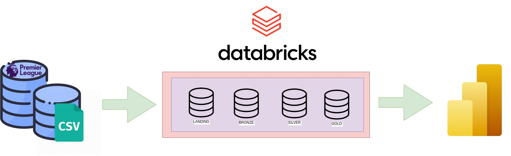

<h1>
<b>Análisis de datos para jugadores de fútbol de la Premier League</b>
</h1>

### <h2><b> ℹ️ Descripción</b></h2>
En el proyecto, se trabajó con una fuente de datos CSV de la Premier League que contenía información sobre los jugadores en diferentes temporadas desde 2014 hasta 2022. Se realizó un proceso de ingesta de datos en Databricks, en el cual se llevó a cabo la transformación y limpieza de los datos, así como el almacenamiento de los mismos en diferentes capas: landing, bronze, silver y gold.

En la capa de landing, se almacenaron los datos crudos en CSV, separados por carpetas de temporadas. En la capa bronze, se almacenaron en formato parquet. En la capa silver, se llevaron a cabo operaciones de agregación para obtener estadísticas de los jugadores en cada temporada, y se almacenaron también en formato parquet. Finalmente, en la capa gold se generaron estadísticas por temporada y jugador, se ordenaron y se guardaron en formato parquet y csv.

Para visualizar los datos, se conectó Power BI a Databricks y se importó el archivo csv generado apartir de las transformaciones de la capa gold. Luego se generaron visualizaciones y se creó un reporte que permite a los usuarios interactuar con los datos de los jugadores y sus estadísticas.

## <h2><b>Pipeline</b></h2>

Pipeline del trabajo realizado.

## <h2><b>REPORTE</b></h2>

Visualización de los jugadores con algunas estadisticas a travez de Power BI.

  

## <h2><b>Instrucciones</b></h2>

- Crear una cuenta en Databricks.

- Levantar un cluster.

- Crear un notebook en Databricks y utilizar SQL para crear las capas landing, bronze, silver y gold, siguiendo los pasos del siguiente [Notebook](fooball_data.ipynb).

- Una vez creadas las capas, mover el archivo al Database Tables.

- Conectarse a Power BI y seleccionar FILE -> GET DATA -> ONLINE SERVICES -> DATABRICKS (BETA), e ingresar las credenciales del servidor hostname: community.cloud.databricks.com y el HTTP PATH que se encuentra en JDBC/ODBC.

- Con los datos cargados, crear el reporte deseado.

## 👨‍💻 Maintainers
* Alexander Lique, Github: [alexliqu09](https://github.com/alexliqu09)
